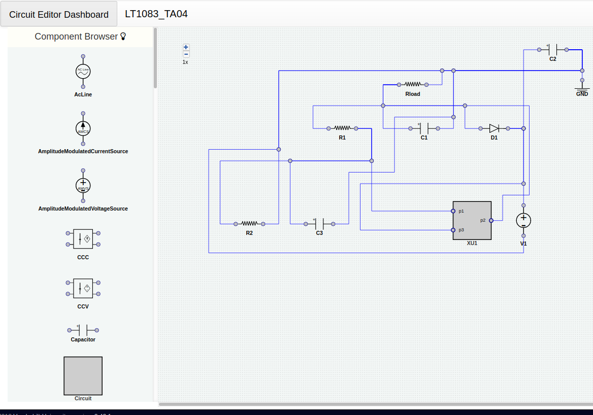
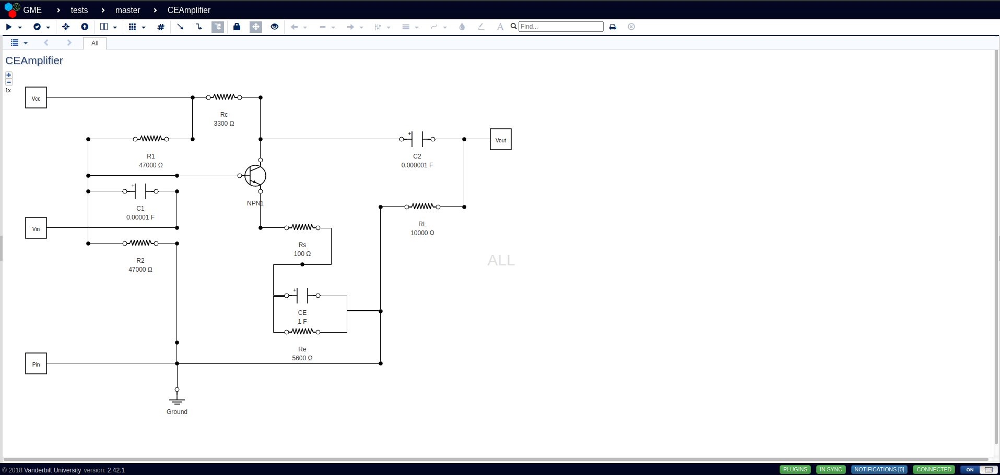

[](https://github.com/marketplace/actions/super-linter)

[](./LICENSE)
[](https://img.shields.io/badge/state-beta-yellow.svg)

# electric-circuits
The electric circuit domain for [webGME](https://webgme.org).

`electric-circuits` is an application for defining, creating and simulating analog electronic circuits, built on top of [webGME](https://webgme.org).



### Capabilities
While it can be used as a general purpose circuit editor, this repository offers the following capabilities:

1. Import SPICE Netlists and create schematic/diagram for the circuit.
2. Export SPICE Netlists from a circuit for further processing/simulation.
3. Using deep learning models, get recommendations on the next components/wires in the circuit.


## Quick Start
Installing this repository requires NodeJS(currently tested for versions 12 and 14), MongoDB and Python > 3.8 with conda. For a native installation, clone this repository:

```shell
$ git clone https://github.com/symbench/electric-circuits
```
Then, create a conda environment using [environment.yml](./environment.yml):
```shell
$ cd electric-circuits
$ conda env create --file environment.yml
```
After that, install node dependencies and start the server.
```shell
$ npm install
$ npm start
```

Finally, navigate to [http://localhost:8888](http://localhost:8888) to start using `electric-circuits`.

## Docker Quick Start
We also offer a docker image for this repository with all the dependencies installed. To start a docker container(without user accounts enabled) for this repository, use `docker-compose`:

```shell
$ docker-compose --file docker-compose-local.yml up
```

## State
This software is currently under active development and therefore unsuitable for production usage.

## Funding Information
This work is supported by DARPA’s Symbiotic Design for CPS project and by the Air Force Research Laboratory (FA8750-20-C-0537).

## LICENSE
[Apache-2.0](./LICENSE)

